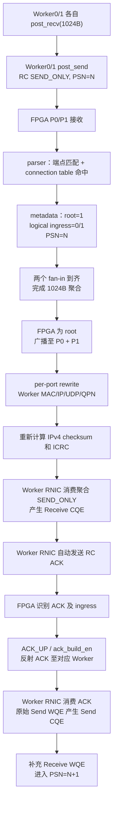

# RDMA AllReduce 工程演进、故障定位与硬件测试指南

> 编写日期：2026-07-29  
> 当前结论：双 Worker、单轮、1024B、RoCEv2 RC AllReduce 闭环已经在真实硬件上成功；连续多轮稳定性尚未完全解决。

## 1. 文档目的

本文不是简单罗列代码差异，而是回答四个问题：

1. 最开始的工程为什么只能“看到报文”，却不能完成 RDMA 状态推进；
2. 当前成功版本相对早期调试状态修改了哪些关键部分；
3. 每个问题是通过什么证据定位、如何修改并验证的；
4. 后续如何以最少试错，在 RDMA 连接下继续开展 FPGA AllReduce 测试。

本文面向当前两 Worker、FPGA 为 root、1024B `SEND_ONLY` 的最小可工作系统。它可以作为后续扩展多轮、更多 Worker 和动态连接表时的基线。

## 2. 工程与版本边界

### 2.1 参考路径

Windows 参考工程：

```text
G:\proj\RDMA_100G_4port_allreduce_proj.xpr\
└─ 100G_4port_allreduce_proj\
   └─ 100G_4port_allreduce_proj.srcs\
```

服务器当前工程：

```text
/home/ubuntu/cyf/NSDI27/100G_4port_allreduce_proj
```

服务器 Worker 程序：

```text
/home/ubuntu/cyf/NSDI27/worker_rdma_qp
```

当前成功测试使用的实现产物：

```text
/home/ubuntu/cyf/NSDI27/100G_4port_allreduce_proj/
  100G_4port_allreduce_proj.runs/impl_1/
  qsfp28_100g_switch_4port_top.bit

/home/ubuntu/cyf/NSDI27/100G_4port_allreduce_proj/
  100G_4port_allreduce_proj.runs/impl_1/
  qsfp28_100g_switch_4port_top.ltx
```

生成时间记录为 2026-07-29 14:19。以后不能只按文件名判断版本，必须同时记录路径、生成时间、源码状态和 VIO 配置。

### 2.2 重要说明

当前 Windows 工程已经包含一部分早期修改，例如 VIO 配置通路，因此它不是完全未经修改的“最初版本”。本文采用两类证据：

- 可以由 Windows 参考源码与服务器当前源码直接确认的差异；
- 由历次 ILA、Wireshark、CQ、Vivado 产物和硬件测试结果确认的早期故障。

凡是不能由当前源码直接证明的早期状态，本文均按“硬件现象”描述，不把推断写成确定的源码事实。

## 3. 最终需要闭环的完整通路



这一闭环中，“FPGA 收到报文”“Wireshark 看到返回包”和“RDMA 操作完成”是三个不同层级：

- FPGA 收到报文，只说明物理链路和部分接收通路有效；
- Wireshark 看到 FPGA 返回包，只说明报文到达主机抓包路径；
- Receive CQE 和 Send CQE 均成功，才说明 RNIC 接受了报文，且 RC 状态机完成推进。

## 4. 工程演进的核心结论

早期失败不是单一原因造成的，而是以下问题叠加：

1. 动态 QPN 与 FPGA 静态配置不一致；
2. VIO 只更新部分字段，烧录后其余字段回到 0；
3. 物理入口编号与 AllReduce 所需的逻辑 Worker 编号不一致；
4. parser 对端点和报文类型的约束不完整；
5. payload 长度把 ICRC 误算入聚合数据；
6. 广播之后的每端口 MAC/IP/UDP/QPN 重写没有在实际烧录版本中正确生效；
7. IPv4 checksum 或 ICRC 没有基于“最终重写后的报文”正确计算；
8. 单拍 ACK 的 `tlast` 处理存在风险；
9. Worker、VIO、bitstream、门控文件和 QP 生命周期没有形成一致的测试顺序；
10. 部分测试把“抓到很多返回包”误判成“RDMA 正常”，实际是 RC 重传。

当前成功版本的关键并非重写了 AllReduce 算法，而是把外围协议通路补齐并对齐：

- connection table 提供稳定的逻辑 ingress；
- parser 严格确认目标端点、QPN 和 opcode；
- 1024B payload 与 ICRC 正确分离；
- root 广播后按每个输出端口重写目的信息；
- checksum 和 ICRC 在最后一次报文修改之后生成；
- ACK 被正确识别、构造和反射；
- Worker 与 VIO 通过动态 QPN 和门控发送建立可复现的测试时序。

值得强调的是：`aggregator_core_top.v` 没有发生实质性的大规模改动。最主要的问题位于 AllReduce 核心的前后两端，而不是 1024B 累加本身。

## 5. 模块级修改总览

| 模块 | 早期问题或限制 | 当前关键修改 | 作用 |
|---|---|---|---|
| `hash_connection_table.v` | 表值主要只有 root 信息；物理入口到逻辑 Worker 的关系不稳定 | 表值扩展为 `{is_root, ingress_port[7:0]}`；当前固定两条 Worker 记录 | 确定 root 和逻辑 ingress=0/1 |
| `parser.v` | 端点准入不足；payload 长度边界错误；ACK 单拍可能影响后包 | 增加 MAC/IP/UDP/QPN/opcode 校验；payload 减去 ICRC；使用表中 ingress；保留 ACK `tlast` | 只让合法 RoCEv2 包进入 AllReduce |
| `allreduce_offload_top.v` | 难以区分“收到包”和“解析命中” | 接入动态配置并增加分阶段 ILA 信号 | 支持逐级定位 parser 故障 |
| `aggregator_core_top.v` | 曾被怀疑为聚合失败来源 | 核心逻辑基本保留 | 说明问题主要不在累加核心 |
| `allreduce_offload_wrapper.v` | 物理端口编码和广播输出语义不清 | one-hot 入口转二进制；在 `TUSER` 标记 AllReduce 生成包和子端口重写 | 为后续逐端口改写提供控制信息 |
| `deparser.v` | 路由、ACK 目标端口和包长处理不完整 | root 广播；ACK 按 ingress 选 QPN；ACK UDP 目标固定为 RoCEv2 端口；精确生成包长 | 构造合法聚合包和反射 ACK |
| `per_port_rewriter.v` | 实际旧 bit 中每端口目的字段未正确生效；ICRC 错误或为 0 | 按端口重写 MAC/IP/UDP/QPN；基于最终报文重新计算 checksum 和 ICRC | 使返回报文真正被目标 RNIC 接受 |
| `allreduce_config_regs.v` / VIO | 硬编码或只改 QPN；重烧后配置丢失 | 完整配置 MAC/IP/UDP/QPN/root/child mask，并用 TCL 一次性下发 | 避免“QPN 对了，但其他字段为 0” |
| `worker_rdma_qp.c` | 早期只能创建 QP、打印 QPN，不能证明闭环 | 支持 RTR/RTS、post_recv、1024B post_send、动态 QPN、PSN、payload、门控和 CQ 记录 | 从报文测试升级到真实 RC 状态测试 |

## 6. 各关键问题的定位与修复

### 6.1 动态 QPN 与 FPGA 配置不一致

#### 现象

Worker 每次启动都会创建新的 RC QP，例如：

```text
local_qpn=151
local_qpn_hex=0x000097
```

下一次进程可能变成 `0x00009b`、`0x00009f`。如果 FPGA 仍使用旧 QPN，报文在以太网层可能到达，但 RNIC 不会把返回包交给当前 QP。

#### 定位方法

同时检查：

```bash
rdma resource show qp
```

以及 Worker 启动输出：

```text
local_qpn_hex=0x......
```

再读取 VIO 中 Worker0/Worker1 QPN。只有三者一致，才能继续发送。

#### 修改与测试方式

Worker 先启动并停在 gate，记录动态 QPN；随后一次性写入 VIO；最后释放发送 gate。不能先发送再更新 QPN。

FPGA 自身使用实验约定 QPN：

```text
FPGA QPN = 0x000100
```

它是 Worker `remote_qpn` 的目标值，不是从 Linux 动态创建出来的 Worker QPN。

### 6.2 VIO 只改 QPN导致完整配置失效

#### 现象

一次失败测试中，Worker QPN 已经是正确的 `0x00009b`，但 VIO 读回显示：

```text
cfg_is_root       = 0
cfg_child_mask    = 0
cfg_fpga_qpn      = 0
cfg_udp_port      = 0
```

因此即使 QPN 看似匹配，parser、root 广播和 per-port rewrite 仍然无法正常工作。

#### 根因

VIO 是易失配置。重新烧录 bitstream 后，probe 输出会回到设计默认值。手工只修改两个 Worker QPN，并不等价于恢复整个连接配置。

#### 当前做法

使用：

```text
scripts/apply_allreduce_vio.tcl
```

一次性写入并读回校验：

```text
FPGA:
  MAC = 02:00:00:00:03:07
  IP  = 192.168.3.7
  UDP = 4791
  QPN = 0x000100

Worker0:
  MAC = 6c:b3:11:88:ab:3e
  IP  = 192.168.3.5
  QPN = 当前 mlx5_0 动态 QPN

Worker1:
  MAC = 6c:b3:11:88:a9:4e
  IP  = 192.168.3.6
  QPN = 当前 mlx5_2 动态 QPN

root       = 1
child_mask = 0x3
```

脚本最后对 `cfg_update_en` 产生一次更新脉冲。以后应把完整 VIO readback 与测试日志保存在同一测试目录。

### 6.3 物理 ingress 与逻辑 Worker 编号不一致

#### 现象

ILA 曾观察到：

```text
Worker0 -> ila_ingress_port = 2
Worker1 -> ila_ingress_port = 1
```

但 AllReduce 期望：

```text
Worker0 -> logical ingress = 0
Worker1 -> logical ingress = 1
```

如果直接把物理端口编码当作聚合槽位，两个 fan-in 可能无法按预期凑齐，或者广播/ACK 选错 Worker。

#### 定位过程

先通过 ILA 确认两个网卡报文都进入 FPGA，再比较：

- 顶层物理端口的 one-hot 编码；
- wrapper 的 one-hot 到二进制映射；
- parser 最终写入 metadata 的 ingress；
- connection table 中 Worker 身份。

由此确认：物理入口位置和“Worker0/Worker1 的逻辑编号”不应被假设为天然相同。

#### 当前修改

connection table 的 value 从单一 root 位扩展为：

```text
{is_root, logical_ingress_port[7:0]}
```

当前两条固定记录：

```text
Worker0 key -> {root=1, ingress=0}
Worker1 key -> {root=1, ingress=1}
```

parser 命中后从表值生成 metadata，而不是直接使用原始物理 ingress。这样“物理接线”和“AllReduce 逻辑身份”解耦。

#### 启发

连接表不应只回答“这个包是否属于连接”，还应该返回后续数据面需要的上下文，例如：

```text
logical_port
is_root
task_id
worker_id
expected_qpn
```

这比在多个 RTL 模块中重复推断身份更可靠。

### 6.4 parser 准入条件不完整

#### 目标规则

当前最小测试只接收满足以下条件的包：

```text
IPv4 protocol == UDP
dst_mac       == FPGA MAC
dst_ip        == FPGA IP
udp_dst_port  == 4791
BTH dst_qpn   == 0x000100
opcode        == SEND_ONLY(0x04) 或 ACK(0x11)
```

#### 当前修改

`parser.v` 接入：

```text
cfg_local_mac
cfg_local_ip
cfg_local_udp_port
cfg_local_qpn
```

并产生分级调试信号：

```text
dbg_s3_valid
dbg_lookup_hit
dbg_endpoint_match
dbg_send_only_match
dbg_opcode
dbg_qpn
```

包只有在 connection table 命中并通过端点检查后，才进入 AllReduce。

#### 为什么必要

只检查 UDP 4791 不能证明报文属于当前 QP。只检查 QPN 也不能排除错误 MAC/IP 或错误协议。将准入条件集中在 parser 中，可以避免无关包污染 PSN、聚合槽位和 ACK 状态。

### 6.5 payload 长度错误：把 ICRC 当作聚合数据

#### 问题

RoCEv2 `SEND_ONLY` 的 UDP payload 包含：

```text
BTH  12B
Data 1024B
ICRC 4B
```

聚合器应处理 1024B Data，而不是 BTH 或 ICRC。

早期长度计算只排除了 UDP/BTH 等部分字段，没有正确排除最后 4B ICRC，可能导致：

- 聚合长度大于 1024B；
- 尾拍位置错误；
- ICRC 被当成数据参与累加；
- 输出包长度和重新计算 ICRC 的边界错误。

#### 当前修改

parser 使用：

```text
payload_length = UDP_length - 24
```

其中 24B 为：

```text
UDP header 8B + BTH 12B + ICRC 4B
```

因此 1024B 应用 payload 被准确交给聚合器。

### 6.6 root 广播与每端口重写

#### 问题

两个 Worker 的聚合结果相同，但返回报文的目标字段不同：

```text
P0 -> Worker0 MAC/IP/QPN
P1 -> Worker1 MAC/IP/QPN
```

如果在广播前只构造一份统一头部，再原样复制到两个端口，至少一个 RNIC 的 MAC/IP/QPN 会错误。

#### 当前数据通路

`deparser.v` 负责构造公共的聚合报文，并在 root 模式选择广播；`allreduce_offload_wrapper.v` 在 `TUSER` 中标记：

```text
AR_GEN
CHILD_REWRITE
output_port_mask
```

每个出口的 `per_port_rewriter.v` 再根据本端口配置修改：

- Ethernet dst/src MAC；
- IPv4 src/dst IP；
- IPv4 header checksum；
- UDP src/dst port；
- BTH destination QPN；
- ICRC。

#### 设计原则

任何与出口有关的字段，都应在 fan-out 之后修改；任何覆盖这些字段的校验值，都必须在最终修改之后计算。

### 6.7 UDP destination port 错误

#### 失败证据

旧测试中，FPGA 返回报文被 Wireshark 抓到，但 UDP 目标端口出现类似：

```text
UDP dst = 55042 / 55298
```

而目标 RNIC RoCEv2 端口应为：

```text
UDP dst = 4791
```

同时可见 FPGA 重复返回相似包，Worker 最终报告：

```text
transport retry counter exceeded
```

#### 为什么会出现大量返回包

RC 发送端在未收到可接受 ACK 时会重传原始 `SEND_ONLY`。FPGA 每收到一次重传，又可能重新生成并广播聚合结果，所以抓包中会出现许多相同 QPN、PSN、payload 的返回包。

报文数量多不是吞吐成功的证据，反而常常意味着协议没有闭环。

#### 修改

- 数据广播在每端口 rewriter 中强制使用目标 Worker 的 RoCEv2 UDP 端口；
- ACK 构造不能把 RNIC 的动态 UDP source port直接当作反射 ACK 的 destination port；
- `deparser.v` 对 ACK 使用配置的 peer/RoCEv2 端口。

#### 验证

仅检查 Wireshark 的 UDP 端口还不够。最终以 Worker Receive CQE、Send CQE 和接收 payload 同时成功为准。

### 6.8 IPv4 checksum 与 ICRC 必须在最终重写后计算

#### 失败现象

早期返回包中出现：

```text
ICRC = 0x00000000
```

或头部已经修改，但 checksum/ICRC 仍对应修改前的报文。此类包可以被网卡线侧抓到，却会被 RNIC 丢弃，不产生 Receive CQE。

#### 当前修改

`per_port_rewriter.v` 在第一拍完成每端口字段改写，并基于改写后的完整报文计算：

- IPv4 checksum；
- RoCEv2 ICRC。

ICRC 状态机增加明确的 finalize 阶段，并处理：

- 1024B 多拍聚合数据；
- 单拍 ACK；
- 最后一拍 ICRC 插入位置；
- AXI-Stream backpressure 下的数据稳定。

#### 验证逻辑

当前成功测试中，RNIC 对 FPGA 返回包产生：

```text
Receive CQE status=success
byte_len=1024
```

这比 Wireshark 的软件校验提示更强，因为它证明目标 RNIC 接受了 MAC/IP/UDP/BTH/PSN/ICRC 组合。

### 6.9 单拍 ACK 的 `tlast` 保存

#### 问题

ACK 报文较短，可能在一个 AXI-Stream beat 中完成。如果 parser 在状态切换时把保存的 `tlast` 清零，就会把下一份 `SEND_ONLY` 的数据误认为 ACK 的后续 payload。

#### 修改

在 ACK 从 IDLE 进入 PROCESS 时保存实际 FIFO `tlast`，而不是写入 0。

#### 作用

ACK 报文在一个 beat 结束后立即释放 parser，防止 ACK 和下一份数据包粘连，避免连续测试时状态错位。

### 6.10 Worker 从“创建 QP”扩展为真实闭环工具

当前服务器 Worker 支持：

```text
-d  RDMA device
-i  IB port
-n  netdev
-G  SGID index
-R  remote GID
-r  remote QPN
-s  SQ PSN
-q  RQ PSN
-N  iteration count
-B  payload byte
-o  runtime record
-w  first-send gate
-W  per-iteration gate prefix
```

它执行：

1. 创建 RC QP；
2. RESET → INIT → RTR → RTS；
3. post Receive WQE；
4. 等待 gate；
5. post 1024B Send WQE；
6. 轮询 CQ；
7. 打印 Receive/Send CQE；
8. 验证接收 payload；
9. 多轮时补充 Receive WQE。

注意：本机工作区中若存在较早的精简版 `worker_rdma_qp.c`，不能直接用它覆盖服务器当前版本。应以服务器当前可执行程序和对应源码为准。

## 7. 最开始为什么失败，当前为什么成功

| 层级 | 最开始的失败 | 当时容易产生的误判 | 当前成功条件 |
|---|---|---|---|
| 网络邻居 | FPGA 不响应 ARP，neighbor 为 `FAILED` | 把 `ibv_modify_qp` 超时认为是 RTL 错误 | 两接口静态 neighbor 为 `PERMANENT` |
| QP 建立 | GID、route、QPN 或 neighbor 不正确 | QP 能创建就等于连接可用 | QP 到 RTS，动态 QPN 写入 VIO |
| FPGA 配置 | 只修改 Worker QPN，root/UDP/FPGA QPN 为 0 | VIO 页面有数值就认为全部生效 | 全字段脚本下发、update pulse、readback |
| parser | 收到帧但不一定命中合法连接 | ILA 有 `tvalid` 就认为进入聚合 | endpoint、table、opcode、QPN 同时命中 |
| ingress | 物理编码 2/1，被直接当成逻辑槽位 | 认为端口号一定等于 Worker 编号 | table 返回 logical ingress 0/1 |
| payload | 1024B 数据边界包含 ICRC | 聚合结果偶然看似正确 | 精确排除 UDP/BTH/ICRC |
| 广播 | 返回包存在，但目的字段不属于目标 Worker | Wireshark 能看到就认为 RNIC 会接收 | 每出口重写 MAC/IP/UDP/QPN |
| 校验 | ICRC 为 0 或对应旧头部 | Wireshark 展示 RR-o-CE 就认为合法 | 最终重写后生成 checksum/ICRC |
| ACK | ACK 构造、目标端口或单拍边界错误 | Receive CQ 成功就认为 Send CQ 必然成功 | RNIC ACK 被 FPGA识别并正确反射 |
| 测试流程 | gate、QP、VIO 和 bitstream 不属于同一轮 | 使用旧 QPN/旧 bit 得出错误结论 | 每轮记录统一的 artifact/config/runtime |

最终单轮成功并不是因为对布局布线做了大量优化，而是协议语义和测试编排终于一致：

```text
正确 bitstream
+ 完整 VIO
+ 当前动态 QPN
+ 正确 logical ingress
+ 正确 1024B 边界
+ 每端口重写
+ 正确 ICRC
+ 正确 ACK 路径
= Receive CQE + Send CQE 均成功
```

## 8. 已确认的成功结果

当前实现完成过一轮受控双 Worker 测试：

```text
FPGA QPN   = 0x000100
Worker QPN = 0x000099
PSN        = 0
Worker0    = 1024B × 0xff
Worker1    = 1024B × 0x00
```

数学期望：

```text
0xff + 0x00 = 0xff
```

两个 Worker 均得到：

```text
Receive CQE: success, byte_len=1024
received payload: all 0xff
Send CQE: success
send_success=1
recv_success=1
iterations_done=1
```

这证明该轮已经覆盖：

- 两个 Worker 的真实 `ibv_post_send()`；
- FPGA 两端口接收；
- connection table 与 parser 命中；
- logical ingress 0/1；
- 1024B fan-in 聚合；
- root 广播；
- 每端口 MAC/IP/UDP/QPN 重写；
- checksum/ICRC 被 RNIC 接受；
- Worker Receive WQE 完成；
- RNIC 自动 ACK；
- FPGA ACK 处理；
- 原始 Send WQE 完成。

因此可以准确表述为：

> 当前工程已经实现双 Worker、单轮、1024B、RoCEv2 RC AllReduce 的真实硬件闭环。

但不能扩大表述为：

> 已经完成任意轮数、任意 Worker 数、生产级稳定的完整 RDMA AllReduce。

## 9. 多轮测试现状与未解决边界

后续五轮手工测试采用：

```text
Worker0 payload = 0x02
Worker1 payload = 0x03
expected result = 0x05
initial PSN     = 10
```

观察结果：

- 第 0 轮：两 Worker 均成功，收到 1024B `0x05`；
- 第 1 轮：Worker0 成功，Worker1 出现 retry exceeded；
- 第 2 轮：只剩 Worker0 到达，无法满足双 fan-in，最终 retry exceeded。

这说明：

- 聚合计算和完整 RC 闭环至少可跨过一轮；
- 多轮时 P1 或协议状态存在间歇性失配；
- 当一侧失败后，另一侧继续发送不可能独立完成双 Worker fan-in。

当前还存在：

```text
P0 rx_crc/symbol errors: 144
P1 rx_crc/symbol errors: 623
```

由于缺少同一轮测试前后的 counter delta，不能断言这些错误都由本轮产生；但 P1 的累计错误更高，与多轮中 Worker1 先失败的现象一致，值得优先复测。

此外当前实现仍有严重时序违例。按本阶段目标，时序没有进行手工 RTL 调优；单轮功能已经成功，但时序违例仍可能解释温度、运行时长或端口相关的间歇性失败。

## 10. 标准单轮硬件测试流程

### 10.1 先确认网络与 RDMA 端口

命令目的：只读取链路、地址、路由、neighbor 和 RDMA 设备状态；不修改工程。风险很低。

```bash
ip -4 addr show dev enp193s0f0np0
ip -4 addr show dev enp129s0f0np0

ip route get 192.168.3.7 from 192.168.3.5
ip route get 192.168.3.7 from 192.168.3.6

ip neigh show 192.168.3.7 dev enp193s0f0np0
ip neigh show 192.168.3.7 dev enp129s0f0np0

rdma link
```

期望：

```text
enp193s0f0np0 -> 192.168.3.5 -> mlx5_0 ACTIVE
enp129s0f0np0 -> 192.168.3.6 -> mlx5_2 ACTIVE
192.168.3.7 neighbor -> 02:00:00:00:03:07 PERMANENT
```

如果 neighbor 丢失，命令目的：在两个 Worker 接口上建立 FPGA 的静态二层映射；它会修改内核邻居表，重启后通常失效。

```bash
sudo ip neigh replace 192.168.3.7 \
  lladdr 02:00:00:00:03:07 \
  nud permanent dev enp193s0f0np0

sudo ip neigh replace 192.168.3.7 \
  lladdr 02:00:00:00:03:07 \
  nud permanent dev enp129s0f0np0
```

### 10.2 确认实际烧录版本

命令目的：只读取 bit/ltx 的时间戳，避免使用过期产物。

```bash
stat \
  100G_4port_allreduce_proj.runs/impl_1/qsfp28_100g_switch_4port_top.bit \
  100G_4port_allreduce_proj.runs/impl_1/qsfp28_100g_switch_4port_top.ltx
```

烧录前还需确认：

- 没有两个 Vivado 进程同时写 `impl_1`；
- `.bit` 和 `.ltx` 来自同一轮实现；
- Hardware Manager 没有仍引用旧备份目录；
- 烧录完成后重新应用完整 VIO。

### 10.3 清除旧 gate

命令目的：删除本轮即将使用的少量临时 gate 文件，防止 Worker 一启动就发送。只允许删除明确命名的 `/tmp` 文件。

```bash
rm -f /tmp/manual_gate0.0 /tmp/manual_gate1.0
```

### 10.4 启动 Worker0

命令会创建并保持一个 RC QP，post 一个 Receive WQE，然后等待 gate；不会在 gate 出现前发送。

```bash
cd /home/ubuntu/cyf/NSDI27/worker_rdma_qp

./worker_rdma_qp \
  -d mlx5_0 \
  -i 1 \
  -n enp193s0f0np0 \
  -G 3 \
  -R ::ffff:192.168.3.7 \
  -r 0x000100 \
  -s 0 \
  -q 0 \
  -N 1 \
  -B 0xff \
  -W /tmp/manual_gate0 \
  -o logs/manual_worker0.runtime
```

记录：

```text
local_qpn_hex=0x......
qp_state=3 (RTS)
send_waiting_for_gate=/tmp/manual_gate0.0
```

### 10.5 启动 Worker1

```bash
cd /home/ubuntu/cyf/NSDI27/worker_rdma_qp

./worker_rdma_qp \
  -d mlx5_2 \
  -i 1 \
  -n enp129s0f0np0 \
  -G 3 \
  -R ::ffff:192.168.3.7 \
  -r 0x000100 \
  -s 0 \
  -q 0 \
  -N 1 \
  -B 0x00 \
  -W /tmp/manual_gate1 \
  -o logs/manual_worker1.runtime
```

同样记录 Worker1 动态 QPN，并确认等待：

```text
/tmp/manual_gate1.0
```

注意：两个 mlx5 设备的 QPN 数值可能相同，也可能不同，均属正常。必须分别读取和配置。

### 10.6 完整配置 VIO

将本轮 Worker0/Worker1 QPN 写入配置脚本或 VIO，随后一次性应用所有字段，并读取确认：

```text
root=1
child_mask=3
FPGA MAC/IP/UDP/QPN 正确
Worker0 MAC/IP/UDP/QPN 正确
Worker1 MAC/IP/UDP/QPN 正确
```

只更新两个 QPN 不足以开始测试。

### 10.7 同步释放单轮发送

命令目的：创建两个空 gate 文件，触发两个已经处于 RTS 的 Worker 各发送一次。它只修改 `/tmp` 中两个文件。

```bash
touch /tmp/manual_gate0.0 /tmp/manual_gate1.0
```

两条 `touch` 越接近越好，但不要求同一个 CPU 周期。聚合器应等待相同 PSN 的两个 fan-in；若一侧迟到，另一侧可短时间等待。若间隔超过 RNIC retry/FPGA slot 生命周期，仍可能失败。

### 10.8 成功判据

两个终端都应出现：

```text
recv CQE status=success
byte_len=1024
recv_payload ... value=expected

send CQE status=success

cq_summary:
send_success=1
recv_success=1
iterations_done=1
```

建议使用非对称 payload：

```text
0xff + 0x00 -> 0xff
0x02 + 0x03 -> 0x05
```

这样可以区分真正聚合结果、单边原样返回和旧缓存数据。

## 11. 多轮测试的正确门控方式

若：

```text
-N 5
-W /tmp/manual_gate0
```

Worker 会依次等待：

```text
/tmp/manual_gate0.0
/tmp/manual_gate0.1
/tmp/manual_gate0.2
/tmp/manual_gate0.3
/tmp/manual_gate0.4
```

`touch /tmp/manual_gate0.0` 多次不会产生多个事件；文件第一次存在后，后续 touch 只更新时间戳。

正确流程：

1. 启动前删除 `.0` 到 `.4` 的旧 gate；
2. 两 Worker 都等待 `.0` 后，同时创建两侧 `.0`；
3. 等两个 Worker 都完成第 0 轮并显示等待 `.1`；
4. 再创建两侧 `.1`；
5. 任一 Worker 失败后停止继续释放 gate，先保存现场。

不要在 Worker1 已经进入 error 后继续触发 Worker0。双 fan-in 缺少一侧时，Worker0 的后续 retry exceeded 是连锁结果，不是新的独立根因。

## 12. ILA 信号选择与分层定位

推荐最小探针集合：

```text
输入层:
  s_axis_tvalid
  s_axis_tready
  s_axis_tlast
  ila_ingress_port

parser:
  dbg_s3_valid
  dbg_lookup_hit
  dbg_endpoint_match
  dbg_send_only_match
  dbg_opcode
  dbg_qpn

聚合:
  ila_agg_fire_payload_en
  ila_dep_agg_req_valid
  ila_dep_from_agg_slot
  ila_FAN_trans

输出:
  ila_m_axis_tvalid
  ila_m_axis_tlast
  ila_m_axis_route_type
  ila_m_axis_tdata_lo
  ila_m_axis_tdata_hi

ACK:
  opcode
  ingress
  ACK_UP / ack_build_en
```

推荐逐层判断：

```text
物理收到
  ↓
parser valid
  ↓
endpoint match
  ↓
connection table hit
  ↓
SEND_ONLY/ACK 分类
  ↓
logical ingress 与 PSN
  ↓
两个 fan-in 到齐
  ↓
root broadcast
  ↓
每端口输出
  ↓
Worker Receive CQE
  ↓
ACK 返回和 FPGA 反射
  ↓
Worker Send CQE
```

不要一次只设置“最终输出”触发。若最终没有输出，无法区分是输入没到、表没命中、PSN 不同、fan-in 未齐还是 root 配置错误。

## 13. Wireshark/tcpdump 应如何使用

### 13.1 为什么成功报文可能抓不到

RoCE 报文由 RNIC 硬件直接发送和接收，普通主机协议栈抓包位置不一定能看到所有正常 RDMA 流量。有效报文可能被 RNIC 消费，不经过常规 Linux packet socket。

因此：

```text
tcpdump/wireshark 看不到
```

不等于：

```text
RNIC 没有发包
```

### 13.2 为什么错误返回包反而容易看到

如果 FPGA 返回包的 UDP port、QPN、PSN 或 ICRC 错误，RNIC 不会把它交给目标 QP。这类未被正常消费的帧更容易出现在抓包路径中。

所以：

- 抓到很多相同返回包，常表示 RC 正在重传；
- 抓不到成功包，但 CQ 成功，属于合理现象；
- Wireshark 是头部核对工具，不是 RDMA 完成的最终判据。

### 13.3 看到返回包时应检查

```text
Ethernet dst/src MAC
IPv4 src/dst
IPv4 checksum
UDP src/dst port
BTH opcode
BTH destination QPN
BTH PSN
payload 长度和内容
ICRC
是否同一 PSN 重复出现
```

优先把抓包与 CQ 时间戳、ILA 触发和 RNIC counter 对齐，避免只看一张截图下结论。

## 14. 常见报错的决策表

| 现象 | 最可能层级 | 首先检查 | 不应立即做的事 |
|---|---|---|---|
| `ibv_modify_qp RTR: Invalid argument` | GID/QP 参数 | SGID index、remote GID、QPN、port | 立即修改 FPGA 聚合 RTL |
| `ibv_modify_qp RTR: Connection timed out` | route/neighbor/link | `ip route get`、`ip neigh`、`rdma link` | 重新综合整个工程 |
| `ip neigh ... FAILED` | FPGA 无 ARP 或静态项丢失 | 静态 neighbor、接口、MAC | 只反复启动 Worker |
| ILA 输入有包但 table miss | parser/table key | MAC/IP 字节序、表项、目标端点 | 修改聚合算法 |
| table hit但不聚合 | metadata/fan-in | ingress=0/1、PSN、root、两侧到达 | 只观察 Wireshark |
| FPGA 有输出但无 Receive CQE | 返回包合法性 | UDP dst、QPN、PSN、ICRC | 认为“有包就成功” |
| Receive CQE 成功但 Send CQE 失败 | ACK 闭环 | Worker ACK、FPGA ACK 分类/反射、PSN | 重写 payload 聚合 |
| 返回包大量重复 | RC retry | 找第一个不被 RNIC 接受的字段 | 把重复包当作高吞吐 |
| 单轮成功、多轮某端口先失败 | 状态或物理稳定性 | PSN推进、Receive repost、ACK、端口错误增量、时序 | 继续释放其余 gate |
| Vivado 显示 out-of-date | run/source/artifact 不一致 | 活跃 run、bit 时间戳、GUI/批处理进程 | 直接烧不明来源 bit |

## 15. 推荐的实验记录格式

每次硬件测试建立独立目录，至少保存：

```text
test_YYYYMMDD_HHMM/
├─ README.md
├─ bitstream_info.txt
├─ vio_readback.txt
├─ network_before.txt
├─ network_after.txt
├─ worker0.log
├─ worker1.log
├─ worker0.runtime
├─ worker1.runtime
├─ rdma_qp.txt
├─ rnics_before.txt
├─ rnics_after.txt
├─ capture.pcapng
└─ ila_capture/
```

`README.md` 建议记录：

```text
Git/source identity:
Bit/LTX path and timestamp:
Vivado run:
FPGA QPN:
Worker0/1 QPN:
SQ/RQ PSN:
Payload:
Iteration count:
VIO readback:
Expected result:
Actual CQ:
First failure:
Conclusion:
```

这样可以避免“同一个文件名、不同 bitstream”“当前 QP 搭配上一轮 VIO”等不可复现实验。

## 16. 后续开展工作的最小基线

在增加功能前，先保留以下已验证基线：

```text
2 Workers
1 root FPGA
1 iteration
1024B payload
SEND_ONLY
FPGA QPN 0x000100
logical ingress 0/1
per-port rewrite
Receive CQE + Send CQE
```

建议按以下顺序扩展，每次只改变一个变量：

1. 同一 bitstream、同一配置下重复单轮 10 次；
2. 测试不同 payload，验证无旧数据残留；
3. 测试不同初始 PSN；
4. 两轮门控测试；
5. 记录 P0/P1 错误 counter 的每轮增量；
6. 再扩展 5 轮、连续发包或更多 Worker；
7. 最后才恢复可写、多表项、冲突处理的动态 connection table。

在单轮基线失效时，不要继续叠加多轮或新功能。

## 17. 当前仍需解决的问题

### 17.1 多轮稳定性

单轮闭环成功，但五轮测试中 Worker1 较早进入 retry exceeded。需要进一步分辨：

- P1 物理链路错误；
- PSN 在 FPGA 或 Worker 侧未一致推进；
- Receive WQE repost 时序；
- ACK 在连续报文间的状态清理；
- 聚合槽位未及时释放；
- 当前严重时序违例导致偶发错误。

建议下一轮先做“两轮、逐轮 gate、全套 ILA、端口 counter 前后差值”，不要直接进行无门控大流量测试。

### 17.2 connection table 可扩展性

当前固定两条表项是为了建立确定的最小硬件闭环。它消除了哈希碰撞、写端口和时序等变量，但不适合作为最终多连接实现。

未来恢复动态表时，至少需要：

- 明确 key/value 格式；
- 写入握手和更新原子性；
- 碰撞处理；
- 无效项与删除；
- 配置时钟域跨越；
- table hit/miss 计数；
- 软件控制面与 QP 生命周期绑定。

恢复动态表前，应保留固定两项版本作为回归基准。

### 17.3 VIO 配置一致性

当前 VIO 适合实验，但仍依赖人工按顺序操作。后续可加入：

- 配置版本号；
- `cfg_valid` 或 commit/ack；
- 一次性 shadow register 提交；
- Hardware Manager 自动 readback；
- 测试脚本校验 QPN 与 Worker runtime 一致。

### 17.4 时序和端口质量

本阶段按功能优先，没有手工修改 RTL 优化时序，也没有对布局布线做专项调优。这不影响“单轮功能闭环已证明”的结论，但影响长期稳定性结论。

后续如果两轮测试仍表现为固定端口先失败，应先用端口 counter 增量和 ILA 证据区分：

```text
物理链路问题
vs
协议/RTL 状态问题
vs
时序偶发问题
```

## 18. 从本次调试得到的通用启发

### 18.1 “报文存在”不等于“协议完成”

RDMA 的最终目标不是生成一个长得像 RoCEv2 的包，而是让 RNIC 的 QP 状态机接受它并推进：

```text
packet arrival
< parser acceptance
< RNIC receive completion
< RC ACK consumption
< send completion
```

测试判据必须逐层升级。

### 18.2 固定拓扑与动态身份应分开

MAC、IP、物理连接和 Worker 角色在一次实验中可以固定；QPN 随进程创建而动态变化。connection table 应把动态连接身份映射为稳定的逻辑身份。

即：

```text
动态 QPN/端点
    ↓
connection table
    ↓
稳定 worker_id / logical_port / role
```

### 18.3 校验值必须位于最后修改点

如果 fan-out 之后还要改 MAC/IP/UDP/QPN，那么 checksum 和 ICRC 必须在该出口的最终重写后计算。否则前面生成得再正确，也会被后面的字段修改破坏。

### 18.4 ACK 是状态转换，不是普通返回包

ACK 的价值在于让 RNIC 从“等待确认”转入“Send WQE 完成”。只验证 FPGA 发出 ACK 外形不够，必须观察 Worker Send CQE。

### 18.5 调试应使用“第一个分叉点”

当 Worker retry exceeded 时，不要从最终错误反向猜整个系统。应找到两个路径第一次出现差异的位置：

```text
输入是否到达？
两侧 parser 是否都命中？
logical ingress/PSN 是否一致？
fan-in 是否到齐？
两个出口是否都发出？
哪个 RNIC 首先不产生 Receive CQE？
哪个 ACK 首先缺失？
```

第一个分叉点通常比最后的错误码更接近根因。

### 18.6 不同 payload 是最低成本的数据正确性探针

用 Worker0=`0x02`、Worker1=`0x03`，期望=`0x05`，可以同时排除：

- 只返回 Worker0；
- 只返回 Worker1；
- 固定填充值；
- 上一轮缓存结果；
- 未执行聚合的原样转发。

PSN 也应随轮次变化，用于区分当前报文和重传/旧包。

### 18.7 工程产物也是设计状态的一部分

源码正确但烧错 bitstream，效果等同于代码错误。每轮实验必须绑定：

```text
source
run
bit
ltx
VIO
QP
PSN
payload
log
```

避免 GUI run、批处理 run 和旧备份 DCP 同时存在却没有明确身份。

## 19. 最终结论

本工程最开始失败的主因，不是 AllReduce 加法核心本身，而是 RDMA 外围协议通路和测试控制面没有完全对齐：

- 动态 QPN 没有与 VIO 生命周期绑定；
- 物理 ingress 没有稳定转换成逻辑 Worker 身份；
- parser 对端点和数据边界的理解不完整；
- 广播后的每端口重写和 ICRC 没有在实际硬件版本中形成正确结果；
- ACK 和 CQ 没有被用作闭环判据；
- bitstream、VIO、QP 和 gate 之间缺少统一实验记录。

当前版本通过最小必要修改，已经证明双 Worker、单轮、1024B AllReduce 可以在真实 RoCEv2 RC QP 下完成发送、聚合、广播、接收和 ACK/CQ 闭环。

下一阶段最有价值的工作不是扩大功能，而是把这一成功基线变成可重复结果：先解决两轮和多轮稳定性，再扩展 connection table、Worker 数量和持续流量。只要继续坚持“逐层证据、单变量修改、产物绑定、CQ 为最终判据”，后续调试会比本轮显著更快、更可靠。
